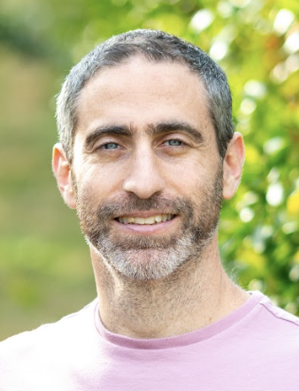

::: {layout="[20,30]" layout-valign="center"}

:::: image_here

::::

:::: name_here
# יאיר מאו

----

 **מרצה בכיר**  
 **המכון למדעי הסביבה**  
  &nbsp; **האוניברסיטה העברית בירושלים**
::::

:::

## יצירת קשר
<i class="fas fa-envelope fa-fw fa-lg svv" aria-hidden="true"></i> &ensp; <bdi dir="ltr">yair.mau@mail.huji.ac.il</bdi>   
<i class="fa-solid fa-phone fa-fw fa-lg svv"></i>
&ensp; <bdi dir="ltr">+972 8 948 9386</bdi>  
<i class="fas fa-map-marked-alt fa-fw fa-lg svv"></i> &ensp; קמפוס רחובות, בניין לובל, משרד 19. <a href="https://goo.gl/maps/DM62y5VXAxJ2" target="_blank">קישור למפה</a>

## אודות

עולם הטבע מרתק אותי.
התחלתי בלימודי פיזיקה, ובהמשך החלטתי להשתמש בכלים מתמטיים כדי להבין תהליכים ב*אזור הקריטי*, ובמיוחד תהליכים הקשורים לשטפי מים ופחמן ברצף **קרקע–צמח–אטמוספרה**, הן בסביבות טבעיות והן בסביבות חקלאיות.

אני מתעניין בהבנת האופן שבו משובים בין האקלים, גורמי עקה שמקורם בפעילות האדם ומערכות אקולוגיות יוצרים דינמיקה סביבתית מעניינת.
הנושאים העיקריים שבהם אני עוסק כוללים **עמידות והישרדות של צמחים בתנאי בצורת, הידרדרות קרקעות ושימוש בר־קיימא במשאבים**.
אפשר לקרוא עוד על כמה מהפרויקטים הנוכחיים שלי ב[ עמוד המחקר](/science.html), ולמצוא פרטים על עבודות שכבר פורסמו ב[ עמוד המאמרים](/papers.html).

מלבד העמודים האקדמיים הרגילים (מחקר, מאמרים, קבוצת המחקר וקורסים), החבאתי הרבה חומר ב[ עמוד ״עוד״](/more): מדריכים (Python, LaTeX), ציטוטים, המלצות ועוד.

## קורות חיים בקצרה

**2016–היום:** חבר סגל באוניברסיטה העברית בירושלים  
**<bdi dir="ltr">2013–2016</bdi>:** פוסט־דוקטורט בהנדסת סביבה, אוניברסיטת דיוק  
**2013:** [דוקטורט](/papers.html#phd-thesis) בפיזיקה, אוניברסיטת בן־גוריון בנגב  
**2009:** [תואר שני](/papers.html#msc-thesis) בפיזיקה, אוניברסיטת בן־גוריון בנגב  
**2005:** תואר ראשון בפיזיקה, אוניברסיטת סאו פאולו  

<a href="https://orcid.org/0000-0001-6987-7597" class="btn my-btn-style btn-sm rounded" role="button">ORCID</a>
<a href="https://scholar.google.com/citations?user=kiKmEQMAAAAJ&hl=en&oi=ao" class="btn my-btn-style btn-sm rounded" role="button">Scholar</a>
<a href="https://huji.zoom.us/my/yairmau" class="btn my-btn-style btn-sm rounded" role="button">Zoom</a>

